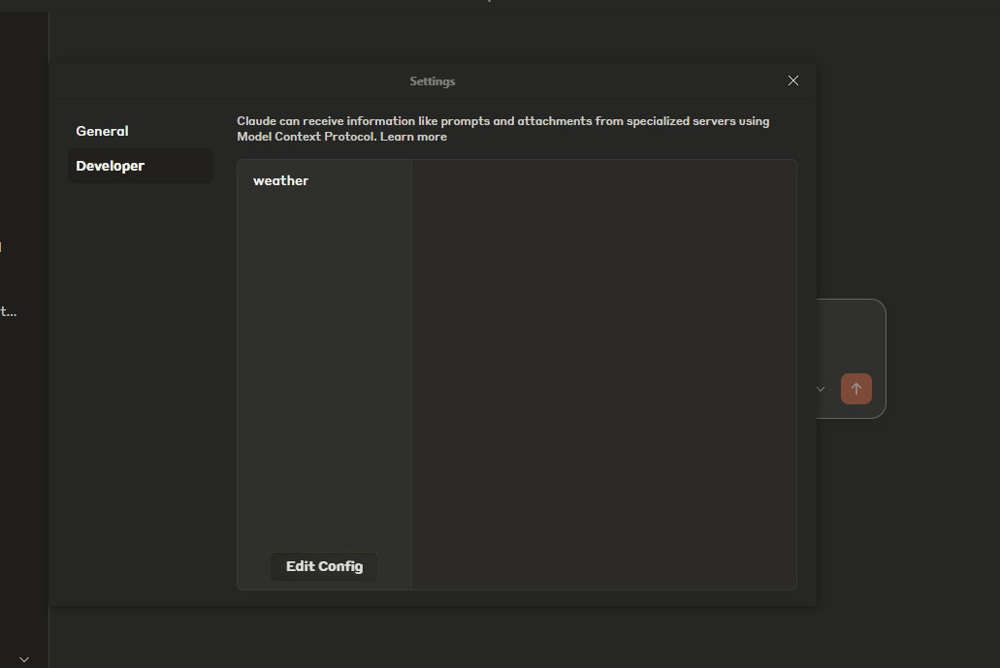

## Installing Dependencies
```bash
npm i
```

## Claude EXAMPLE



Open Claude and turn ON Developer Mode. Open the File >> settings and open the edit config. Paste the below config and edit it as per required.

```json 
{
    "mcpServers": {
        "weather": {
            "command": "path\\to\\your\\app\\node.exe",
            "args": [
                "path\\to\\your\\app\\index.js"
            ]
        }
    }
}
```

## Usage
1. Open The Claude and check if everything is working
2. Type the prompt in the way that the claude should understand that you are asking to use the MCP server or asking to use the related service.
3. You should see the appropriate results according to your prompt.